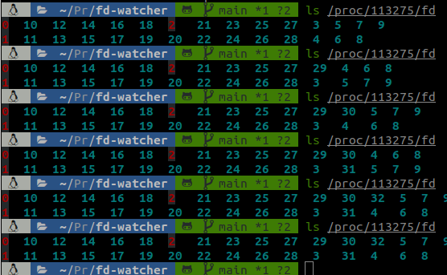

In my (quite short) experience as a software engineer, I’ve already encountered memory leaks more than once, whether it
be my fault (for example when using FastAPI in synchronous mode with a RAM-heavy use case, perhaps this should actually 
be another blog post altogether) or some third party library’s fault. But I’ve actually grown fond of debugging those, 
as they’re sometimes the symptoms of bad software design that can be corrected at the same time. This blog post is about
the first type of leak I encountered, the one that made me love debugging performance issues (especially lower level ones) : the file descriptors leak.

# The Beginning

When working with pdf libraries, or libraries that involve managing resources (especially the ones leveraging bindings 
with lower level languages) one must be cautious that open resources are actually closed after having been used. 
Unfortunately, sometimes those libraries are not thread-safe, inducing unpredictable side effects if not managed correctly.
Well, this was one of those times. In an early release of the excellent wrapper [`pypdfium2`](https://github.com/pypdfium2-team/pypdfium2), 
the [`Pdfium`](https://pdfium.googlesource.com/pdfium/) library was not thread safe on two 
functions that I used in my code, and I had absolutely no idea. This code was running under several gunicorn workers in `gthread`
with a lot of threads, and of course, this was the perfect setting for a good old race condition. 

At first, I did not understand: the memory kept on growing and I had thoroughly checked that the pdf object (wrapper and
raw object) had been closed! But then I let the load test run for a longer period of time, and sure enough I hit `ulimit`!
As I was starting to understand where it could come from, I thought I’d build myself a convenient tool to better
identify what was actually happening.

# The Leak

If you want to easily reproduce the leak at home (why would you though ?), here's a nifty script to do so
```python
import os
import time

if __name__ == '__main__':
    base_path = "path/to/data/folder"
    file_dict = {}
    for file in os.listdir(base_path):
        file_dict[file] = open(os.path.join(base_path, file))
        print("open")
        time.sleep(1)
```
With this script, we can notice a steady increase on the number of file descriptors (the blue numbers on the image):
<p align="center">

</p>
<p align="center">This is what directly looking in the file descriptors folder of the process looks like</p>

# The Tool

Since I thought that this tool should have a really small time and memory overhead, I thought I’d write it in `C`. To be
frank, this was an excuse to write some `C`, since I had always been fascinated by this language seeing my father write
an absurd amount of code and always complaining about how easy it was to mess things up incredibly fast. 

The logic behind this tool is pretty simple: as we suspect that the descriptors are leaking, we need to find a way to
see if all descriptors that are open by a process at some point end up being closed. To further simplify, we can
actually only look at the evolution of the number of descriptors simultaneously opened by a process, and see if
this number is increasing (and even exploding if there’s a leak).


To do so, assuming we have sufficient privileges, we can look at /proc/<pid> where a lot of information on the process 
is located, and in particular, a convenient folder called fd, where descriptors are opened and closed! We then only have
to list the number of files in that folder at a fixed interval and see if that number goes up ! 

Ah, I see you wondering: “but wouldn’t it just be ls /proc/<pid> | wc -l in bash Matthias ?
Why did you bother to write 500 lines of C for this ?” Well you’re right, but it was fun and actually taught me an awful
lot about C and its most incredible friend: stack buffer overflow  gdb.


[include image of sample output and increasing counter depicting leak]
# The Grand Finale

When I actually used the tool I built in the real setting and it revealed a gigantic growth of file descriptors clearly
indicating that this was indeed the root cause of the leak, I couldn’t believe my eyes: I had built something useful
for once and it had exhibited the problem that was plaguing my work until then!
Then of course began the much less flashy part of the work where I had to put locks before the critical functions
in my code to prevent this awful thing from happening, but I was happy anyways.

# Conclusion

Please build and share tools even if you think they’re useless, this seemingly little thing is actually the most useful
thing I’ve built until now and I’m still using it whenever I have a leak to rule out descriptors! I’ll also finish 
re-writing it in Rust soon when I’ll get time and maybe add nifty features to it to make it more user-friendly!
